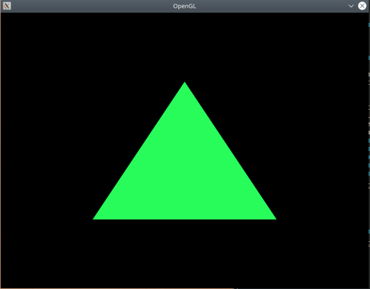

# OpenGL Demos

This repository contains a few small demos of [OpenGL](https://open.gl/) code.

Each demo is a subfolder with C++ code and a Makefile. To run the `uniform-example`:

```bash
$ cd uniform-example/
$ make
$ ./grun
```



## REQUIREMENTS

1. SDL      (context, input)
1. GLEW     (to use newer OpenGL functions)
1. SOIL     (for textures)
1. GLM      (for vectors and matrices)

# Helpguide

### Installing SDL2

Stackoverflow: [https://askubuntu.com/questions/707001/ubuntu-15-10-installing-sdl2](https://askubuntu.com/questions/707001/ubuntu-15-10-installing-sdl2)

(just libraries)
`$ sudo apt-get install libsdl2-2.0`

(development)
`$ sudo apt-get install libsdl2-dev`

### Installing GLEW

(development)
`$ sudo apt-get install libglew-dev`

### Including SDL2

Include `/usr/include/SDL2` instead of `usr/include/SDL`.

In Makefile, use flag: `-I/usr/include/SDL2`

### Including GLEW

### Linking SDL2(input, media), GLEW(modern OpenGL function), GL(actual OpenGL library)

use compilation flags `-lSDL2 -lGLEW -lGL`

### Getting SEGFAULT at `glGenBuffers()`

According to [OpenGL forums](https://www.opengl.org/discussion_boards/showthread.php/170104-glGenBuffers-segfault),

call glGenBuffers after window and context creation (with SDL).

### Catching errors with OpenGL using callbacks

[Khronos: Catching Errors with Callbacks](https://www.khronos.org/opengl/wiki/OpenGL_Error#Catching_errors_.28the_easy_way.29)

1. enable debug output
1. register callback
1. wait for it to be called
